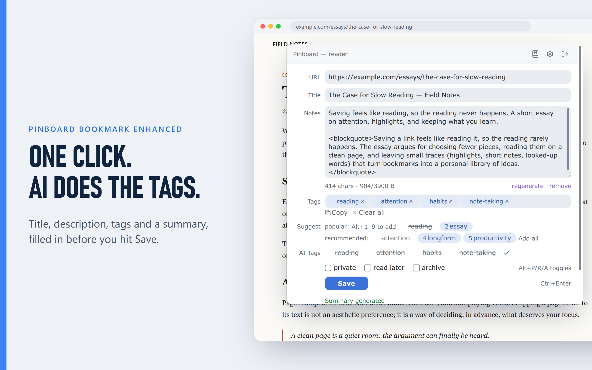
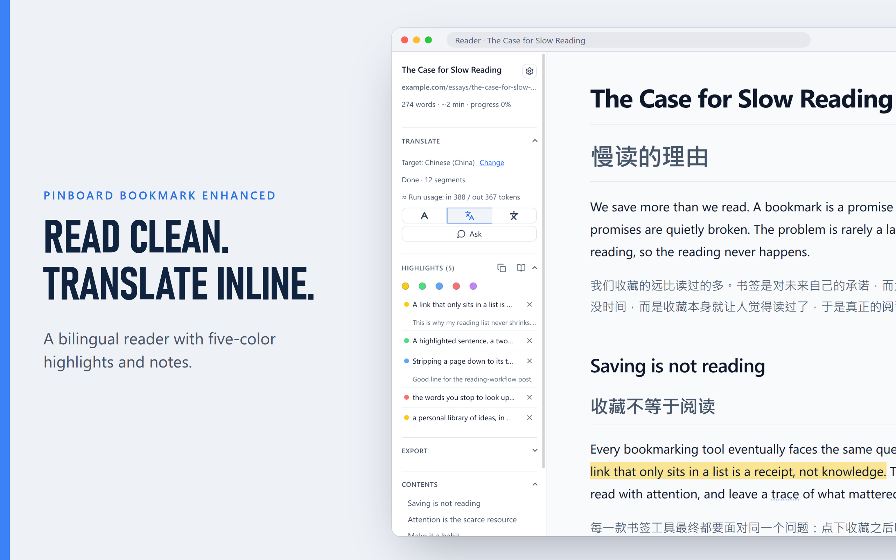
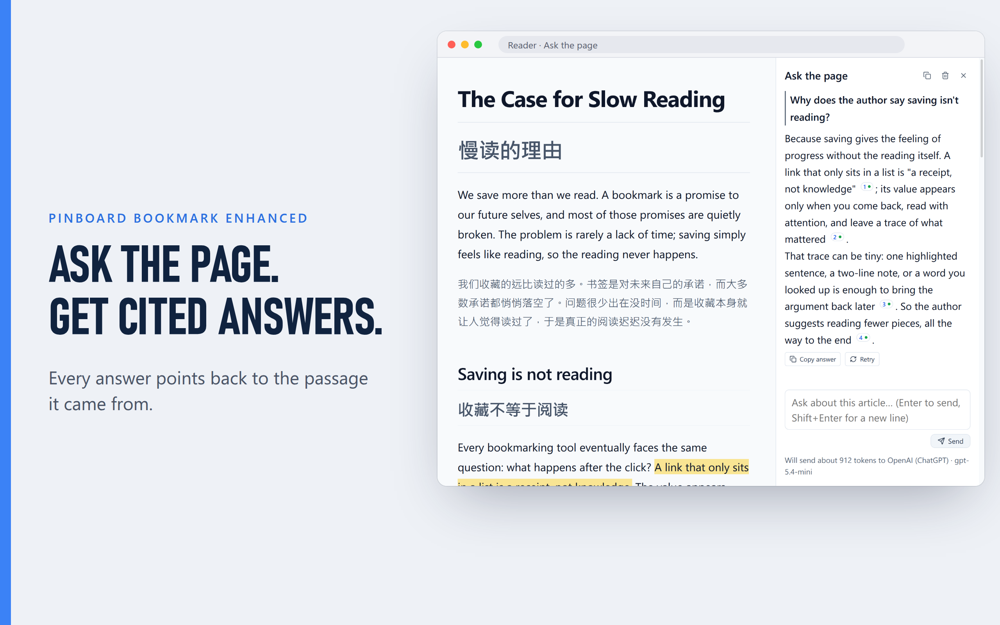
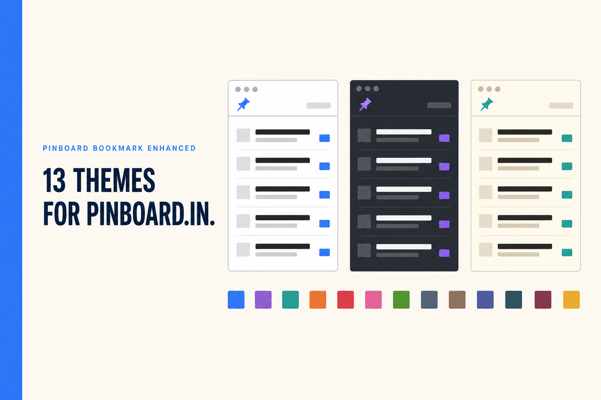

# Pinboard Bookmark Enhanced

[English](README.md) | [简体中文](README.zh-CN.md) | [繁體中文](README.zh-TW.md) | [繁體中文（香港）](README.zh-HK.md) | [Deutsch](README.de.md) | [Français](README.fr.md) | **日本語** | [Polski](README.pl.md) | [Русский](README.ru.md)

[Pinboard](https://pinboard.in) のための Chrome 拡張機能。AI タグと要約、翻訳・ハイライト付きの内蔵リーダー、pinboard.in 用テーマ 13 種を備えています。

> **注意:** Pinboard.in アカウントが必要です。[Pinboard](https://pinboard.in)（pinboard.in）は独立した**有料**のブックマークサービスです。本拡張機能は、ご自身の Pinboard API token を使って既存の Pinboard アカウントに接続するサードパーティ製クライアントであり、Pinboard との提携・出資・公式の承認は一切ありません。本拡張機能を利用するには、有料の Pinboard.in アカウントを既にお持ちであるか、新たに登録する必要があります。

---

## 機能

### 保存
- **ワンクリック保存**：タイトル・説明・選択テキストを自動入力し、URL のトラッキングパラメーターを除去します
- **ショートカットで直接保存**：ポップアップを開かず保存でき、開いているタブの一括保存もできます
- **オフラインでも保存**：いったんローカルキューに入り、再接続後に自動で再試行します
- **未保存の下書きを復元**：ポップアップを開き直すと編集を再開できます。下書きは24時間後、またはブラウザの再起動時に消去されます

### タグ
- **AI タグ・要約**：広告・メニュー・サイドバーを除いた記事本文だけを読み取ります。API キーは自前で、14 のプロバイダーまたは任意の OpenAI 互換エンドポイントを使えます
- **タグ補完**：自分のタグ、Pinboard のおすすめ、ワンタップのプリセットから入力できます
- **タグ整理**：重複タグや使用回数の少ないタグを洗い出し、まとめて統合します

### リーダー
- **どんなページもすっきりしたリーダーに**：目次・検索・脚注プレビュー付きの Markdown 表示。数式・図・表もきちんと表示されます
- **5 色のハイライトとメモ**：再描画・翻訳・ページ内容の変化をまたいでも保持されます
- **ページ全体の翻訳とページへの質問**：対訳表示に対応し、回答には出典への引用が付き、クリックで該当箇所へジャンプします
- **読みながら単語を調べる**：読んでいる文に合った語義がまず表示されます。保存した単語にはメモや学習ステータスを付けられ、Anki や Eudic にも送れます。中英・英中のオフライン辞書パックも選べます
- **メモと単語帳に専用ページ**：保存した単語とハイライトが一か所に集まり、辞書検索も一括管理もできます。メモの編集やハイライトの色変更も直接でき、結果がないときは検索と絞り込みを解除できます
- **送信もダウンロードも**：[Obsidian](https://obsidian.md)・Notion・NotebookLM・GitHub Gist・任意の webhook へ送信でき、`.md`・`.html`・`.epub` で電子書籍リーダーにも渡せます
- **読みながら観る**：YouTube と Bilibili のプレビューは動画と多言語字幕を並べて表示し、字幕は再生に追従、行クリックでジャンプでき、AI タグと要約も字幕を直接読めます

### カスタマイズ
- **pinboard.in 用テーマ 13 種**（Dracula、Nord、Catppuccin、Solarized など）を設定画面でローカルプレビューでき、自分のカスタム CSS も重ねられます
- **[Wayback Machine](https://web.archive.org) へ自動アーカイブ**：有効にすると保存のたびに送信し、元のページが消えてもあとから参照できます
- **バックアップと同期**：設定は Chrome Sync、単語帳は自分の Google Drive で同期でき、手動の JSON バックアップにはハイライト・メモ・単語帳・API キーを含められます。いずれもオプトインで、詳細は下記の「プライバシー」を参照してください
- **9 言語対応** · カスタマイズ可能なショートカット · ローカルファースト保存 · トラッキング一切なし

## インストール

**[→ Chrome ウェブストアからインストール](https://chromewebstore.google.com/detail/pinboard-bookmark-enhance/pnjndmjhljjbdlbejeenkepdalokfooh)**（推奨）

または、リリース ZIP を解凍して読み込む:
1. 最新の [リリース ZIP](https://github.com/pine2D/Pinboard-Bookmark-Enhanced/releases/latest) をダウンロード
2. 解凍
3. `chrome://extensions/` → **デベロッパーモード** を有効化 → **パッケージ化されていない拡張機能を読み込む** → 解凍したフォルダを選択

ソースディレクトリには、固定された開発用 ID が設定されています。そのため、テスト時には Chrome ウェブストア版と同じプロフィールで併用できます。リリース ZIP は Chrome ウェブストア版と同じ ID を使用するため、両方を同じプロフィールにはインストールできません。各デバイスで設定の同期を有効にすると、Chrome Sync で設定を共有できます。以前のリリース ZIP から移行する場合は、先に設定をエクスポートし、新しいリリースを読み込んでからバックアップをインポートしてください。

インストール後: ツールバーのアイコンをクリック → [Pinboard API トークン](https://pinboard.in/settings/password) を貼り付け → 保存

## プライバシー

トラッキング、解析、テレメトリは一切ありません。新規ユーザーでは、設定と認証情報は既定でこのデバイスに保存されます。通常の設定同期はデバイスごとに個別に有効化します。認証情報の同期は Chrome アカウント全体のひとつの選択ですが、設定同期を有効にしたデバイスだけが参加し、それ以外のデバイスはローカルの認証情報を使い続けます。新規ユーザーでは認証情報の同期は既定で無効です。アップグレード時に Chrome Sync に空でない認証情報がすでに存在する場合は、データ損失を避けるため有効のまま維持されます。有効にすると、API キー、トークン、パスワード、エクスポート先の認証情報が Chrome Sync 経由で共有されますが、難読化されるだけで暗号化はされません。保存済みブックマーク、ページ内容、オフラインキューは Chrome Sync には入りません。AI リクエストは、AI タグ・要約、ページへの質問、翻訳、選択範囲の解説、オプトインの要点スキムといった、有効にした、または呼び出した機能を通じて**のみ**発生し、設定したプロバイダーに直接送信されます。インストール時に許可されるのは Pinboard へのアクセスだけです。AI、Jina、Batch で選択したサイト、および任意のエクスポート・アーカイブ先は、対応する操作を行うときに、その正確なサイトへの権限だけを要求します。カスタムのネットワークエンドポイントには HTTPS が必要で、HTTP は `localhost`、`127.0.0.1`、`[::1]` に限り許可されます。拡張機能の各ページは厳格な Content-Security-Policy（リモートコードを禁止）を適用しています。詳細ポリシー: <https://pine2d.github.io/Pinboard-Bookmark-Enhanced/privacy.html>

## ライセンス

MIT。[LICENSE](LICENSE) を参照。
