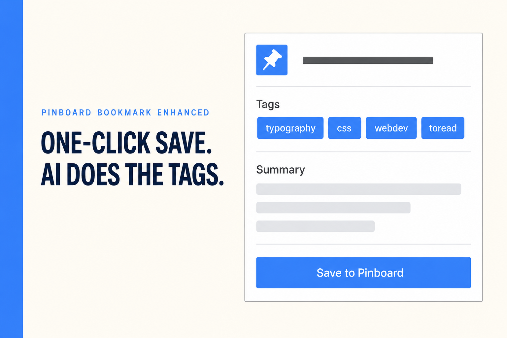
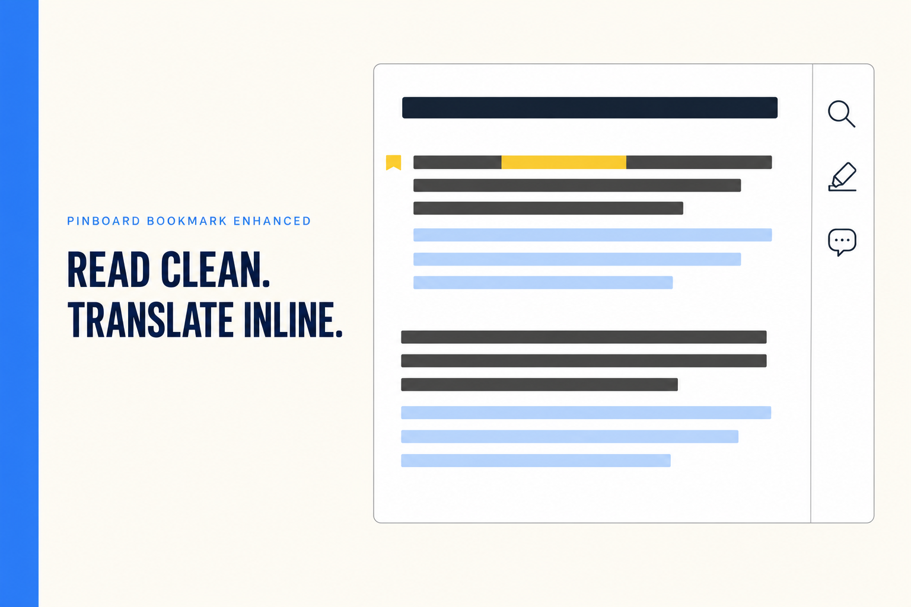
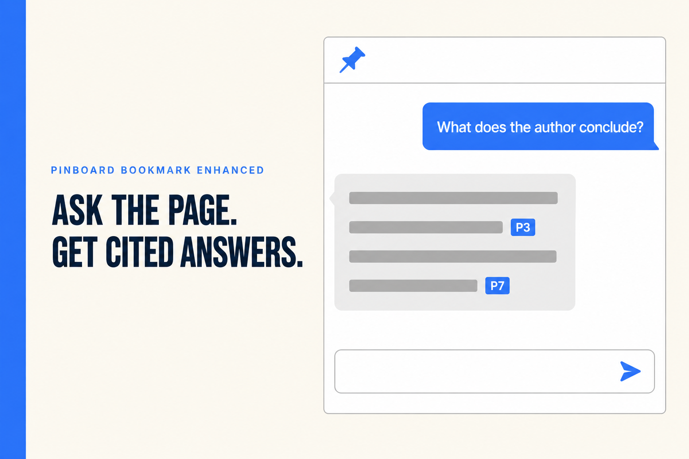
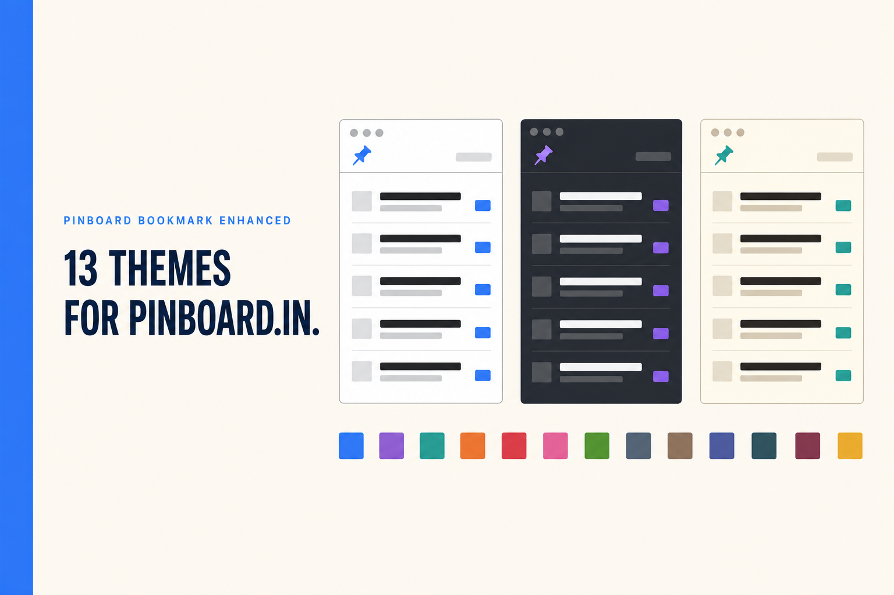

# Pinboard Bookmark Enhanced

**English** | [简体中文](README.zh-CN.md) | [繁體中文](README.zh-TW.md) | [繁體中文（香港）](README.zh-HK.md) | [Deutsch](README.de.md) | [Français](README.fr.md) | [日本語](README.ja.md) | [Polski](README.pl.md) | [Русский](README.ru.md)

A Chrome extension for [Pinboard](https://pinboard.in): AI tags and summaries, a built-in reader with translation and highlights, and 13 themes for the site itself.

> **Note:** This extension requires a Pinboard.in account. [Pinboard](https://pinboard.in) is an independent, **PAID** bookmarking service. This extension is a third-party client that connects to your existing Pinboard account with your own Pinboard API token. It is not affiliated with, sponsored by, or endorsed by Pinboard. You must already have (or sign up for) a paid Pinboard.in account to use this extension.

---

## Features

### Save
- **One click, everything filled in**: the title, description, and selected text are picked up for you, and tracking parameters are stripped from the URL
- **Save by hotkey**: skip the popup entirely, or batch-save every open tab at once
- **Works offline**: saves are queued locally and retried when you're back online

### Tag
- **AI tags & summary**: the AI reads the article body with ads, menus, and sidebars stripped out; bring your own key (13 providers, or any OpenAI-compatible endpoint)
- **Autocomplete** from your own tags, Pinboard's suggested tags, and one-tap presets
- **Tag cleanup**: find duplicate and rarely-used tags and merge them in batches

### Read
- **Any page becomes a clean reader**: a Markdown view with a table of contents, search, and footnote peek
- **Five-color highlights with notes**: both survive re-renders, translation, even page edits
- **Translate the page or ask it questions**: full-page translation with a bilingual view; answers cite the source and jump straight to it
- **Look up and review words as you read**: use online definitions or an optional offline Chinese-English dictionary; save, search, sort, and group vocabulary; export all entries from the current Pinboard account or send them to Anki, and send entries in supported languages to Eudic
- **Send or download**: send to [Obsidian](https://obsidian.md), a GitHub Gist, or any webhook; download as `.md`, `.html`, or `.epub` for your e-reader

### Make Pinboard yours
- **13 themes for pinboard.in** (Dracula · Nord · Catppuccin · Solarized · …) plus your own custom CSS
- **Auto-archive to the [Wayback Machine](https://web.archive.org)**: optionally submit every save, so pages stay reachable after the original link dies
- **Settings backup**: export to a file, or auto-back-up to your own WebDAV server
- **9 languages** · configurable shortcuts · local-first storage · zero tracking

## Install

**[→ Install from Chrome Web Store](https://chromewebstore.google.com/detail/pinboard-bookmark-enhance/pnjndmjhljjbdlbejeenkepdalokfooh)** (recommended)

Or load unpacked from a release ZIP:
1. Download the latest [release ZIP](https://github.com/pine2D/Pinboard-Bookmark-Enhanced/releases/latest)
2. Unzip
3. `chrome://extensions/` → enable **Developer mode** → **Load unpacked** → select the unzipped folder

After installing, click the toolbar icon → paste your [Pinboard API token](https://pinboard.in/settings/password) → save

## Privacy

No tracking, no analytics, no telemetry. For new users, settings and credentials stay on this device by default. Ordinary settings sync is enabled separately on each device. Credential sync is one Chrome-account-wide choice, but only devices with settings sync enabled participate; other devices continue using local credentials. New users start with credential sync off, while upgrades keep it on when non-empty credentials already exist in Chrome Sync to avoid data loss. When enabled, API keys, tokens, passwords, and export credentials are shared through Chrome Sync and are obfuscated, not encrypted. Saved bookmarks, page content, and the offline queue never enter Chrome Sync. AI requests are sent **only** through features you enable or invoke (AI tags/summary, page Q&A, translation, selection explain, or the opt-in key-points skim) and go directly to the provider you configured. At install time, only Pinboard access is granted; AI, Jina, Batch-selected sites, and optional export, archive, and backup destinations request only the exact site permission when you use the corresponding action. Custom network endpoints must use HTTPS; HTTP is allowed only for `localhost`, `127.0.0.1`, and `[::1]`. Extension pages enforce a strict Content-Security-Policy (no remote code). Full policy: <https://pine2d.github.io/Pinboard-Bookmark-Enhanced/privacy.html>

## License

MIT. See [LICENSE](LICENSE).
