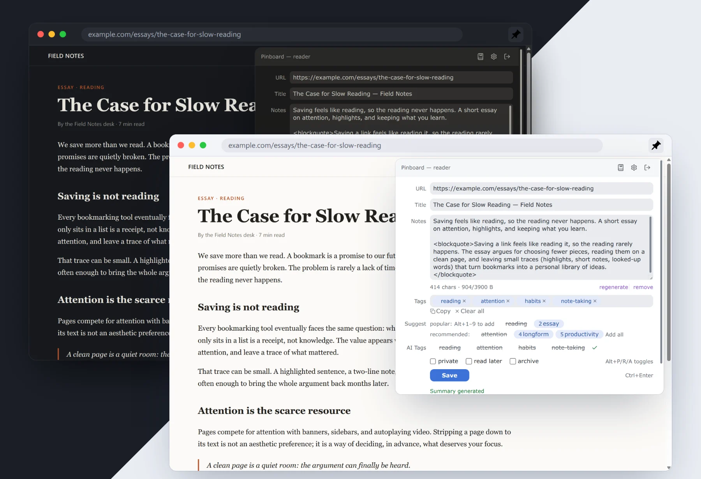
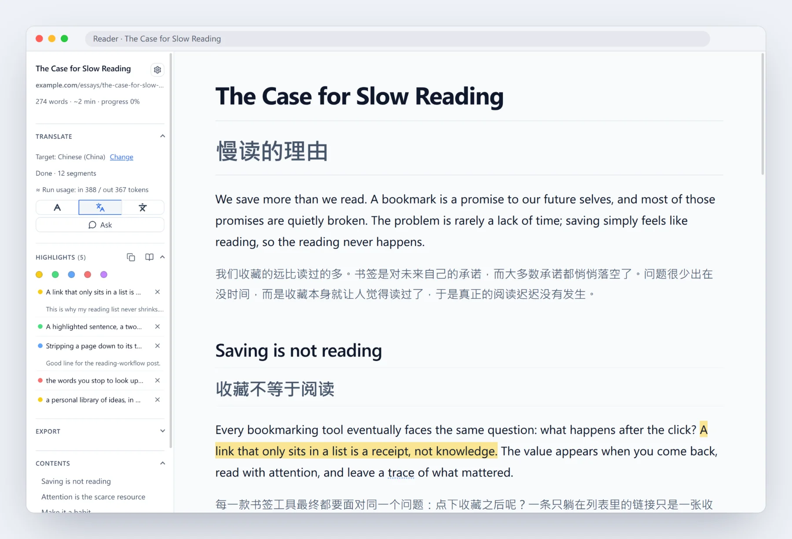
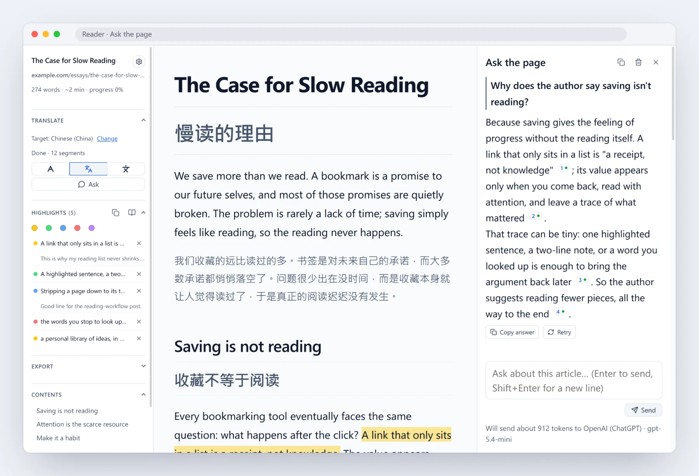
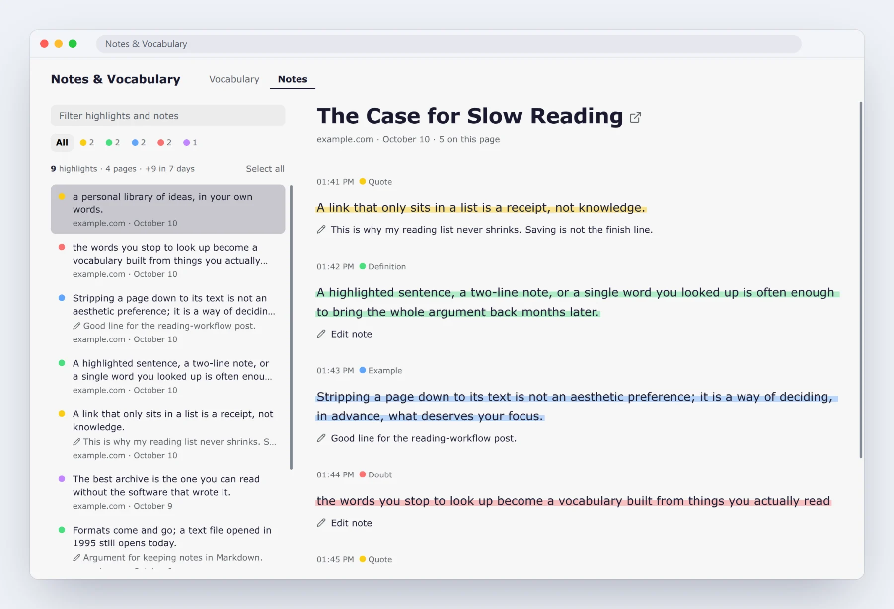
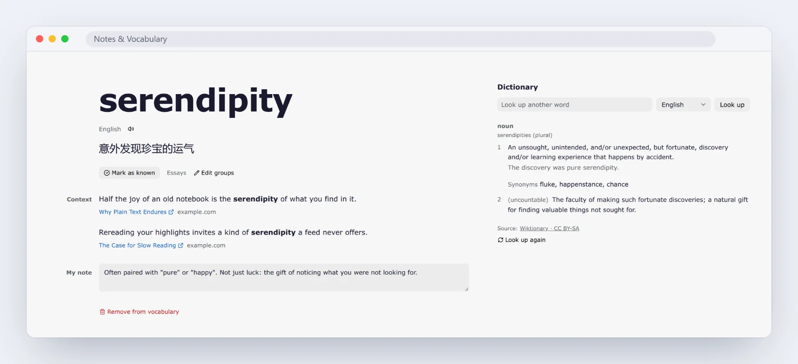
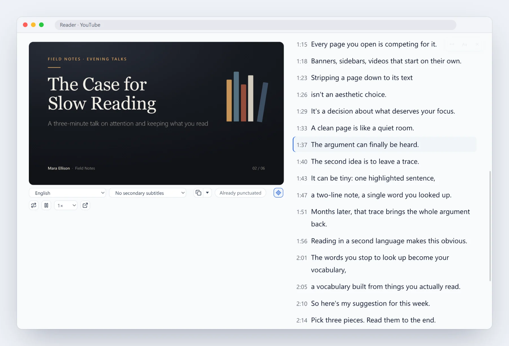
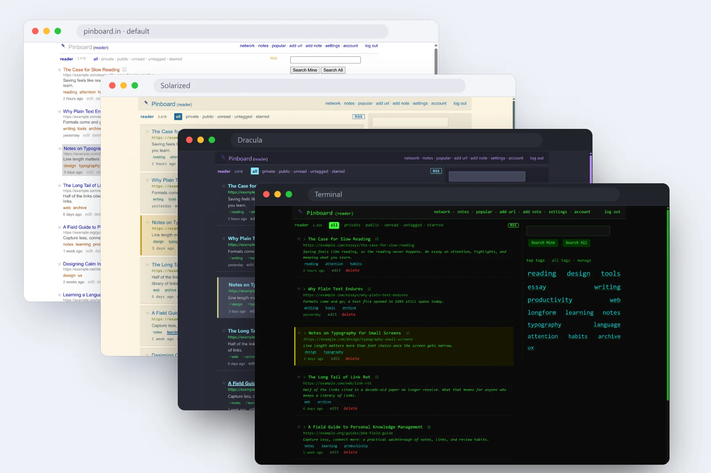

# Pinboard 书签增强

[English](README.md) | **简体中文** | [繁體中文](README.zh-TW.md) | [繁體中文（香港）](README.zh-HK.md) | [Deutsch](README.de.md) | [Français](README.fr.md) | [日本語](README.ja.md) | [Polski](README.pl.md) | [Русский](README.ru.md)

为 [Pinboard](https://pinboard.in) 打造的 Chrome 扩展：AI 标签与摘要、带翻译和高亮的内置阅读器，以及 13 套站点主题。

> **说明：** 需要 Pinboard.in 账号 —— Pinboard（pinboard.in）是一项独立的**付费**书签服务。本扩展是第三方客户端，使用你自己的 Pinboard API Token 连接到你已有的 Pinboard 账号。本项目与 Pinboard 官方无关，未获其赞助或认可。你必须已经拥有（或注册）一个付费的 Pinboard.in 账号才能使用本扩展。

---

## 功能特性

### 保存
- **一键保存，信息自动填好**：标题、描述和选中文本一并填入，并去掉 URL 里的追踪参数
- **快捷键与批量保存**：不开弹窗直接保存，或一次收藏当前窗口的所有标签页
- **断网也能保存**：先进本地队列，恢复联网后自动重试
- **草稿不丢**：关掉弹窗再打开，接着写

### 标签
- **AI 生成标签和摘要**：只读文章正文，不掺广告、菜单和侧边栏；自备 API Key，14 家服务商或任意 OpenAI 兼容接口
- **标签自动补全**：历史标签、Pinboard 建议、一键预设
- **标签治理**：合并近似标签，清理低频标签

### 阅读
- **网页变成清爽的阅读器**：Markdown 视图，带目录、搜索和脚注速览；公式、图表、表格都正常显示
- **五色高亮与笔记**：切换翻译、原文改动后仍留在原处
- **整页翻译，或向文章提问**：双语对照；回答附引用，点击直达原文出处
- **边读边查词**：先显示贴合当前句子的释义；生词一键发到 Anki 和欧路词典，还可以选择离线汉英、英汉词典包
- **笔记和生词独立成页**：生词和高亮集中一处，随手查词、批量管理
- **发送或下载**：[Obsidian](https://obsidian.md)、Notion、NotebookLM、GitHub Gist 或任意 webhook；`.md`、`.html`、`.epub` 供电子书阅读器
- **边读边看**：YouTube 和 B 站视频旁边配上随播放滚动的字幕，AI 标签和摘要可以直接读字幕

### 个性化
- **13 套 pinboard.in 主题**（Dracula、Nord、Catppuccin、Solarized 等），还能叠加自定义 CSS
- **自动存档到 [Wayback Machine](https://web.archive.org)**：每次保存都留一份快照，原链接失效也能找回
- **备份与同步**：设置走 Chrome Sync，生词和高亮走自己的 Google Drive，JSON 备份文件一次存下全部
- **9 种语言**、可自定义快捷键、本地优先存储、零追踪

## 安装

**[→ 从 Chrome 网上应用店安装](https://chromewebstore.google.com/detail/pinboard-bookmark-enhance/pnjndmjhljjbdlbejeenkepdalokfooh)**（推荐）

或从 release ZIP 手动加载：
1. 下载最新的 [release ZIP](https://github.com/pine2D/Pinboard-Bookmark-Enhanced/releases/latest)
2. 解压
3. `chrome://extensions/` → 开启**开发者模式** → **加载已解压的扩展程序** → 选择解压后的目录

源码目录使用独立且固定的开发版 ID，可与 Chrome 网上应用店版本共存，方便测试。release ZIP 使用 Chrome 网上应用店 ID，不能与商店版同时安装在同一 Chrome 个人资料中。在每台设备上开启设置同步后，Chrome Sync 即可共享设置。如果要替换较早的解压安装版，先在旧版设置页点「导出备份」，加载新版后再点「导入备份」。

安装完成后：点击工具栏图标 → 粘贴你的 [Pinboard API Token](https://pinboard.in/settings/password) → 登录

## 隐私

零追踪、零分析、零遥测。新用户的设置和凭据默认保存在本机。普通设置同步需在每台设备上分别开启。凭据同步是 Chrome 账号级选项，但只有开启普通设置同步的设备才会参与；关闭普通设置同步的设备继续使用本地凭据。新用户的凭据同步默认关闭；若升级时 Chrome Sync 已有非空凭据，则为避免数据丢失会保持开启。开启后，API Key、Token、密码和导出凭据会通过 Chrome Sync 共享，只做混淆，没有加密。书签内容、页面内容和离线队列不会通过 Chrome Sync 同步。AI 请求**只**来自你开启或使用的 AI 功能，并直接发往你配置的服务商。安装时只授予 Pinboard 访问权限。其他站点（AI 服务商、导出或存档目标、词典、Google Drive、视频字幕，以及批量保存涉及的站点）都在你首次使用相应功能时逐个申请，且只申请精确站点。自定义网络端点必须使用 HTTPS；HTTP 仅允许用于 `localhost`、`127.0.0.1` 和 `[::1]`。扩展页面强制执行严格的内容安全策略（Content-Security-Policy，禁止远程代码）。完整政策：<https://pine2d.github.io/Pinboard-Bookmark-Enhanced/privacy.html>

Google Drive 需在每台设备上分别连接，只同步当前 Pinboard 账号的所选数据：连接后默认选中生词，高亮与笔记需另行开启。同步范围保存在本机；Drive 私有 appDataFolder 中的副本是明文，未经端到端加密。

## 许可证

MIT，见 [LICENSE](LICENSE)。
